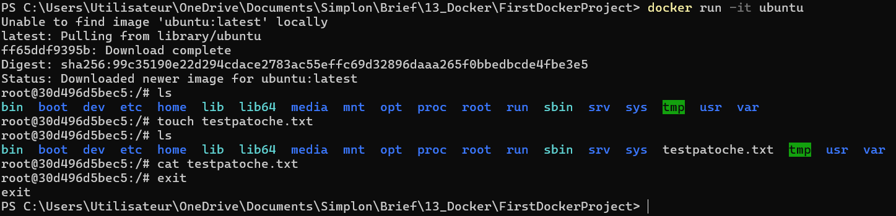
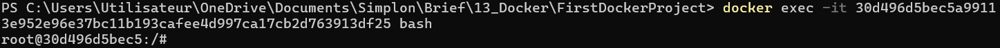
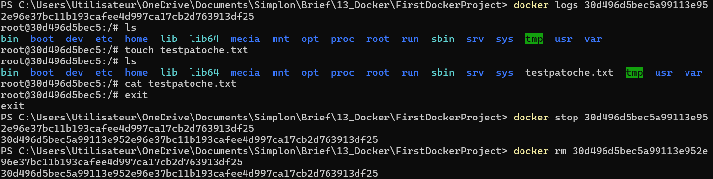
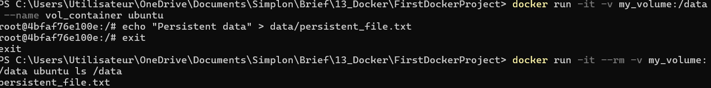
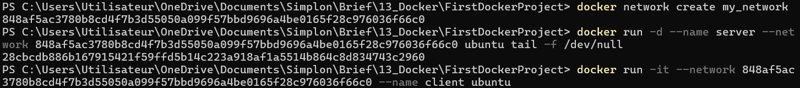
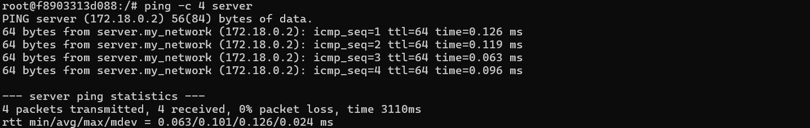

### PHASE 2

1. **Lancer un conteneur Ubuntu en mode interactif et explorer les commandes Linux :**
   - Ouvre un terminal (PowerShell ou Git Bash) et lance le conteneur Ubuntu en mode interactif :
     ```bash
     docker run -it ubuntu
     ```
   - Une fois dans le conteneur, explore quelques commandes :
     - Crée un fichier :
       ```bash
       touch myfile.txt
       ```
     - Liste les fichiers et répertoires :
       ```bash
       ls
       ```
     - Affiche le contenu d’un fichier :
       ```bash
       cat myfile.txt
       ```
    **Résultat :**
    \
    \
     
 
2. **Exécuter une commande dans un conteneur en cours d’exécution avec `docker exec` :**
   - Exécute une commande dans le conteneur avec `docker exec` :
     ```bash
     docker exec -it my_ubuntu_container bash
     ```
    **Résultat :**
    \
    \
     

3. **Récupérer les logs d’un conteneur avec `docker logs` et supprimer un conteneur arrêté avec `docker rm` :**
   - Affiche les logs du conteneur `my_ubuntu_container` :
     ```bash
     docker logs my_ubuntu_container
     ```
   - Arrête le conteneur :
     ```bash
     docker stop my_ubuntu_container
     ```
   - Supprime-le :
     ```bash
     docker rm my_ubuntu_container
     ```
    **Résultat :**
    \
    \
     
4. **Monter un volume dans un conteneur et observer la persistance des données :**
   - Lance un conteneur avec un volume monté :
     ```bash
     docker run -it -v my_volume:/data --name vol_container ubuntu
     ```
   - Crée un fichier dans le volume `/data` :
     ```bash
     echo "Persistent data" > /data/persistent_file.txt
     ```
   - Quitte le conteneur avec `exit`.
   - Relance le conteneur et vérifie que le fichier est toujours présent :
     ```bash
     docker run -it --rm -v my_volume:/data ubuntu ls /data
     ```
    **Résultat :**
    \
    \
     
5. **Créer un réseau Docker et connecter deux conteneurs :**
   - Crée un réseau :
     ```bash
     docker network create my_network
     ```
   - Lance un conteneur sur ce réseau comme serveur :
     ```bash
     docker run -d --name server --network my_network ubuntu tail -f /dev/null
     ```
   - Lance un deuxième conteneur sur le même réseau comme client :
     ```bash
     docker run -it --network my_network --name client ubuntu
     ```
   **Résultat :**
    \
    \
     
   - Dans le conteneur client, teste la communication avec le serveur en le pingant :
     ```bash
     ping -c 4 server
     ```
   **Résultat :**
    \
    \
     